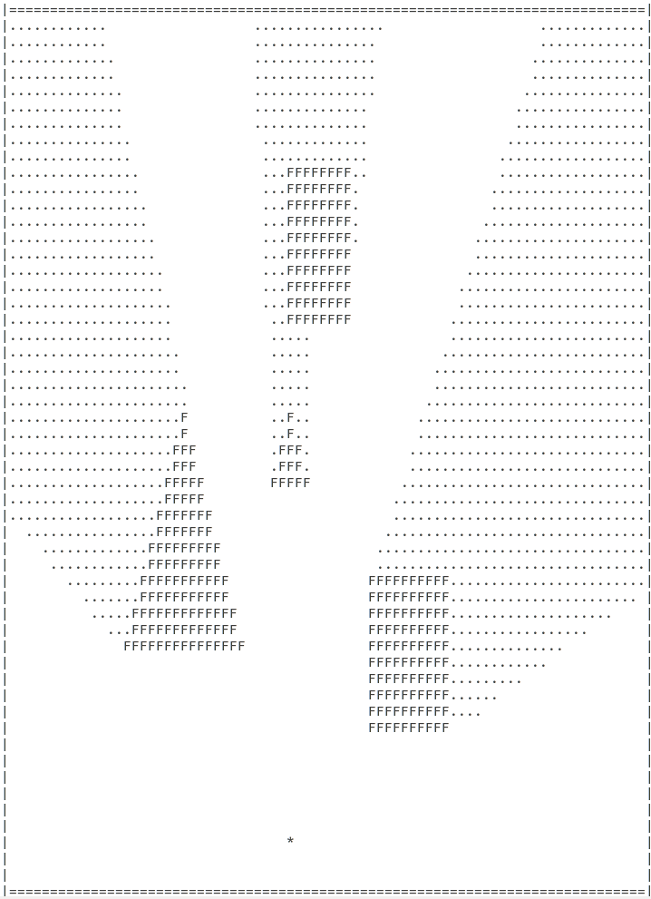

# ASCII renderer
> Program tworzy obrazki figur geometrycznych, w formie plikow ASCII

## Spis tresci
* [Podstawowe Informacje](#podstawowe-informacje)
* [Mozliwosci programu](#mozliwosci-programu)
* [Screenshots](#screenshots)
* [Kompilacja i uruchamianie](#kompilacja-i-uruchamianie)
* [Uzywanie programu](#uzywanie-programu)
* [Kontakt](#kontakt)

## Podstawowe Informacje
Program rysuje figury geometryczne w ukladzie kartezjanskim N x N oraz na podstawie polozenia punkty swiatla rysuje ich cien .
- Rodzaje figur do narysowania przez program oraz ich parametry, podaje się w zalaczonym pliku konfiguracyjnym config.json .

Paramatry figur: 
- polozenie lewego dolnego wierzcholka w przypadku prosokatow, srodka kola w przypadku kola, 
- dlugosci bokow figury (promien w przypadku kola),
- Polozenie punktu swiatla.
- Symbole: tla, czesci zajmowanej w ukladzie przez figury, czesci zajmowanej przez cien.

## Mozliwosci programu
Program jest w stanie narysowac prostokat ( w tym kwadrat ) oraz trojkat.

## Screenshots

## Kompilacja i uruchamianie

Do projektu zostaly dolaczone pliki obiektowe. Mozna je usunac i skompilowac program jeszcze raz.

Kompilacja:
Kompilacja bezposrednio poprzez g++ :

... 

g++ -std=c++11 -c pliki_cpp/biblioteka_funkcji.cpp -o pliki_obiektowe/biblioteka_funkcji.o -Ipliki_h

g++ -std=c++11 -c pliki_cpp/Trojkat.cpp -o pliki_obiektowe/Trojkat.o -Ipliki_h

g++ -std=c++11 -c pliki_cpp/Punkt.cpp -o pliki_obiektowe/Punkt.o -Ipliki_h

g++ -std=c++11 -c pliki_cpp/Prosta_Pionowa.cpp -o pliki_obiektowe/Prosta_Pionowa.o -Ipliki_h

g++ -std=c++11 -c pliki_cpp/Kwadrat.cpp -o pliki_obiektowe/Kwadrat.o -Ipliki_h

g++ -std=c++11 -c pliki_cpp/Light.cpp -o pliki_obiektowe/Light.o -Ipliki_h

g++ -std=c++11 -c pliki_cpp/Canvas.cpp -o pliki_obiektowe/Canvas.o -Ipliki_h

g++ -std=c++11 -c pliki_cpp/ASCIICanvas.cpp -o pliki_obiektowe/ASCIICanvas.o -Ipliki_h

g++ -std=c++11 -c pliki_cpp/Prosta.cpp -o pliki_obiektowe/Prosta.o -Ipliki_h

g++ -std=c++11 -c pliki_cpp/Prostokat.cpp -o pliki_obiektowe/Prostokat.o -Ipliki_h

g++ -std=c++11 pliki_obiektowe/biblioteka_funkcji.o pliki_obiektowe/Trojkat.o pliki_obiektowe/Punkt.o pliki_obiektowe/Prosta_Pionowa.o pliki_obiektowe/Kwadrat.o pliki_obiektowe/Light.o pliki_obiektowe/Canvas.o pliki_obiektowe/ASCIICanvas.o pliki_obiektowe/Prosta.o pliki_obiektowe/Prostokat.o main.cpp -o ASCIIrenderer

... 

Powstaje plik wykonywalny o nazwie ASCIIrenderer

Do projektu zostal dolaczony plik Makefile. 
kompilacja za pośrednictwem programu make :

...

$ make

... 

Uruchamianie programu :
Program wykonywalny ASCIIrenderer powstaje w katalogu, w ktorym znajduje sie plik main.cpp .

...

$ ./ASCIIrenderer config.json

... 

## Uzywanie programu

Nalezy podac nazwe programu wykonywalnego i jako argument wywolania programu, nazwe pliku konfiguracyjnego.
...

$ ./ASCIIrenderer config.json

... 

Plik konfiguracyjny jest intuicyjny.
W pliku konfiguracyjnym w tablicy kazdej z figur mozna dopisac dowolna ilosc kwadratow/prostokatow/trojkatow.
Nalezy przy tym pamietac o polozeniu przecinkow w odpowiednich miejscach.

## Kontakt
przemyslaw.wlazly@student.uj.edu.pl

